# Memory, Context & Self-Improve trong hệ thống AI Agent

---

## 1 — Vấn đề

Bạn vừa giải thích xong cả buổi sáng cho AI, rồi chiều hỏi lại — nó không nhớ gì cả.

Agent tự động sửa code, chạy lại, fail mãi một lỗi — nhưng không bao giờ rút kinh nghiệm.

Đây không phải vấn đề về **trí thông minh** của model — mà là vấn đề về **kiến trúc hệ thống**.

### Vấn đề thực tế trong AI agent

| Vấn đề                      | Hệ quả                                                                 |
| --------------------------- | ---------------------------------------------------------------------- |
| Stateless by default        | Mỗi request đến LLM là độc lập, không có state giữa các lần gọi        |
| Context window giới hạn     | Conversation dài bị cắt, thông tin đầu session bị "quên"               |
| Không học từ lỗi            | Agent lặp lại sai lầm trong các task tương tự                          |
| Chi phí tăng theo thời gian | Nhồi toàn bộ history vào context → token tăng, latency tăng, cost tăng |

---

## 2 — Khái niệm

### Context window

Context window là giới hạn tối đa số token mà model có thể nhìn thấy (input) và xử lý (output) cùng một lúc.

**Ví dụ thực tế** — Claude Sonnet 4.6 — Context 200K, Max Output 64K

```
Trường hợp 1: Input:  180,000 tok  →  Output tối đa: 20,000 tok (bị giới hạn bởi context)
Trường hợp 2: Input:  10,000 tok   →  Output tối đa: 64,000 tok (bị giới hạn bởi max output)
```

Trong thực tế, hầu hết các model hiện nay đều có giới hạn max output token để đảm bảo request luôn kết thúc cũng như đảm bảo chất lượng cho output, tránh bị loãng.

→ Cần tối ưu cả input cũng như output để có thể đạt được kết quả mong muốn với chi phí tốt nhất

### Memory

Là khả năng lưu trữ và truy xuất thông tin vượt qua ranh giới của một session hay context window.

**Phân loại:**

— **Short-term memory**: là bộ nhớ lưu trữ tạm thời, dung lượng nhỏ.

Một số loại & cách triển khai:

- **in-context window / sliding / truncation** — nhét toàn bộ hoặc 1 phần lịch sử hội thoại gần nhất vào prompt
- **summarization / token budget / compression** — nén nội dung cũ bằng llm trước khi đưa vào context

— **Long-term memory**: là bộ nhớ lưu trữ lâu dài, dung lượng lớn.

Một số loại:

- **Semantic** — Kiến thức tổng quát về thế giới, facts, dữ liệu cụ thể từ tài liệu nội bộ
- **Episodic** — Lịch sử, sự kiện
- **Procedural** — Cách làm, kỹ năng | Tool defs, System prompt, Workflows
- **Prospective** — Việc cần làm | Task queue, Scheduler

=> Key-Value store, Knowledge graph, Vector DB

### Self-improve

Cơ chế agent điều chỉnh hành vi dựa trên kết quả và feedback.

**Client-side (prompt engineering thuần túy):**

- **Memory & RAG** — lấy thông tin liên quan, nhét vào system prompt hoặc user prompt trước khi gọi llm
- **Tool results** — chạy code/search bên ngoài, đưa kết quả vào prompt.
- **Reflection loop** — gọi model nhiều lần, output lần trước trở thành input lần sau => model tự đánh giá và cải thiện dần kết quả cuối cùng.
- **Prompt optimization** — tự động viết lại prompt dựa trên số liệu, đánh giá từ các mẫu có sẵn. Một số phương pháp/quy trình giải quyết vấn đề này:
  - Prompt compression: nén prompt/context → giảm cost, nhưng dễ mất info
  - Fewshot: Cung cấp một vài ví dụ (input → output) trực tiếp trong prompt để model học theo pattern.
  - APE: Dùng LLM để tự sinh ra và đánh giá các candidate prompt. Pipeline: LLM đề xuất nhiều prompt → chạy trên tập eval → chọn prompt tốt nhất → có thể lặp lại
  - Chain-of-Thought: Yêu cầu model suy nghĩ từng bước trước khi trả lời

- **Multi-agent** — nhiều lần gọi llm với vai trò (role) khác nhau, sau 1 chuỗi phản biện, bổ sung => tạo ra kết quả.
  hoặc chạy song song nhiều agent để tìm kết quả tốt nhất

**Provider-side — “cải thiện ở tầng nhà cung cấp”, không phải chỉnh prompt của bạn**

- **Fine-tuning / RLHF** — Model được **huấn luyện lại** trên dữ liệu mới hoặc feedback (thumbs up/down, so sánh câu trả lời nào tốt hơn…). Kết quả: **trọng số** của mạng thay đổi; lần sau model “đã nặn sẵn” xu hướng đó. Khác hẳn với việc bạn viết lại system prompt một lần.

- **Self-play training** — Model (hoặc nhiều bản copy) **tự sinh hội thoại / bài tập**, chấm điểm hoặc lọc mẫu tốt, rồi dùng mẫu đó để train tiếp. Ứng dụng ngoài **không thể** tự chạy vòng lặp này nếu không có pipeline huấn luyện và phần cứng.

- **Tính toán lúc infer (“test-time compute”, kiểu o3)** — Trước khi trả một câu, hạ tầng có thể **thử nhiều hướng**, chấm điểm bằng quy tắc hoặc model phụ, rồi chọn câu tốt. Bạn vẫn gọi một API; phần “suy nghĩ lâu hơn / thử nhiều lần” nằm **bên trong server**, không phải do bạn tự loop reflection trong prompt.

- **Meta-learning** — Không chỉ học nội dung cụ thể, mà học **cách học nhanh hơn** (ví dụ khởi tạo hoặc quy tắc cập nhật sao cho ít bước train đã kháp task mới). Cần **vòng huấn luyện** lớn ngoài tầm một app chat thông thường.

- **Reward model / critic** — Một model nhỏ hơn hoặc tách biệt **chấm điểm** output để phục vụ RL hoặc lọc ứng viên. Bạn có thể chỉ **gọi API chat**; phần train reward/critic là **provider** làm phía sau.

---

## 3 — Tại sao chat history không đủ?

Nhét toàn bộ history vào prompt → llm sẽ phải tính lại attention score → độ phức tạp tăng lên rất nhanh

Không có memory → agent không biết user preference → trải nghiệm rời rạc

Không có self-improve → lặp lại lỗi đã biết → agent không "trưởng thành"

History là chuỗi thẳng, không tìm kiếm được theo nghĩa → muốn lấy lại "user đã nói gì về sở thích tuần trước" thì phải đọc toàn bộ → chậm, không thể mở rộng

Hội thoại dài chứa đầy câu hỏi dở dang, đổi hướng, nói chuyện xã giao → nhét nguyên xi vào thì thông tin quan trọng bị loãng trong nhiễu → model tốn công lọc, câu trả lời kém hơn

Hệ thống agent thực tế cần **quản lý bộ nhớ có chủ đích** — biết cái gì cần nhớ, cái gì có thể bỏ, và khi nào cần học lại.

---

## 4 — Luồng hoạt động



---

## 5 — Demo / Use case

### Khung demo — Discord chatbot

**Stack:** Node.js · LangGraph · PostgreSQL + pgvector · Discord Bot · Langfuse · LLM (DeepSeek)

**Thiết lập:** 2 channel Discord — cùng một user, cùng một loạt câu hỏi, cùng thứ tự.

| Channel        | Cấu hình                                                                 |
| -------------- | ------------------------------------------------------------------------ |
| `#no-memory`   | Không có memory — mỗi tin nhắn là một request độc lập                    |
| `#with-memory` | Có memory — context được lưu và truy xuất qua message history, vector db |

**Kịch bản:** User lần lượt hỏi về 6 chủ đề theo cùng một thứ tự ở cả hai channel:

```
Chủ đề 1 — LLM      "Bạn nghĩ gì về model nào đang tốt nhất hiện tại?"
Chủ đề 2 — Bản thân  "Tôi là backend dev, đang học AI"
Chủ đề 3 — Lập trình "Recommend tôi một pattern để handle async trong Node.js"
Chủ đề 4 — Fitness   "Tôi đang tập gym buổi sáng, gợi ý bài tập cho ngày bận"
Chủ đề 5 — Thú cưng  "Con mèo tôi hay cắn dây điện, làm sao trị?"
Chủ đề 6 — Game      "Tôi thích game chiến thuật, recommend tôi cái gì?"
```

**Kết quả quan sát:**

```
#no-memory      →  mỗi câu trả lời generic, không liên hệ các chủ đề với nhau
                   chủ đề 3 không biết user là backend dev
                   chủ đề 6 không biết user thích chiến thuật hay casual

#with-memory    →  từ chủ đề 3 trở đi: biết user là backend dev → recommend phù hợp hơn
                   chủ đề 6: kết hợp "thích chiến thuật" + "hay bận" → gợi ý game phù hợp

```

---

## 6 — Benefits / Trade-offs

### Nên dùng khi

- Agent tương tác nhiều lần với cùng một user
- Task lặp lại, cần học preference theo thời gian
- Workflow dài, cần giữ state giữa các bước
- Muốn giảm token cost dài hạn (tóm tắt thay vì nhồi raw history)

### Cẩn thận khi

- Memory cũ có thể sai hoặc outdated → cần chiến lược cập nhật hoặc truy vấn cho từng trường hợp
- Self-improve có thể học hành vi sai nếu feedback có noise → cần có những nguồn đáng tin để kiểm soát (con người, 1 llm tốt,..)
- Thêm latency (nhanh hay chậm tuỳ vào kiến trúc, cần cân nhắc giữa tốc độ, trải nghiệm và sự chính xác)
- Privacy: user data trong vector DB cần quản lý và phân quyền rõ ràng

### Không nên dùng khi

- Task one-shot, không có thông tin nào từ lần trước giúp ích cho lần sau. (dịch văn bản, tóm tắt tài liệu, format data,..)
- Dữ liệu thay đổi liên tục và nhanh, vòng đời ngắn làm memory lưu lại sẽ sai ngay sau vài phút (giá cổ phiếu, trạng thái đơn hàng real-time)

---

## 7 — Summary

1. **Context window = cái agent đang "nghĩ"** — quản lý tốt context window (input-output) giúp agent thông minh hơn với ít token hơn.
2. **Memory không phải "chat history"** — đó là hệ thống lưu trữ có chủ đích với các chiến lược lưu trữ và truy vấn tối ưu cho các trường hợp cụ thể.
3. **Self-improve không cần retrain** — không cần động vào model weights. Reflection loop + memory ở tầng prompt engineering là đủ để agent tích lũy kinh nghiệm theo thời gian. Nhiều giới hạn nằm ở kiểm soát chất lượng feedback, không phải hoàn toàn ở bản thân llm.

---

## 8 — Q&A & References

### Câu hỏi gợi ý thảo luận

- Tại sao không sử dụng full-text search thay cho semantic search?
- Khi context window của LLM tăng rất lớn (ví dụ >1M token), llm có thể xử lí được rất nhiều input - output, liệu còn cần hệ thống memory bên ngoài (vector DB, retrieval…) không? Vì sao?
- Việc self-improve bằng prompt engineering khác gì so với fine-tuning mô hình? Ưu và nhược điểm của mỗi cách?

### Tài nguyên

**Thuật ngữ nền tảng**

| Khái niệm                         | Tài nguyên                                                                                                                |
| --------------------------------- | ------------------------------------------------------------------------------------------------------------------------- |
| LLM Tokens & Context Window       | Stanford CS324 — [Modeling lecture](https://stanford-cs324.github.io/winter2022/lectures/modeling/)                       |
| Text Embeddings                   | Mikolov et al. — [Efficient Estimation of Word Representations in Vector Space](https://arxiv.org/abs/1301.3781) (2013)   |
| Sentence Embeddings               | Reimers & Gurevych — [Sentence-BERT](https://arxiv.org/abs/1908.10084) (2019)                                             |
| Semantic Search / Dense Retrieval | Karpukhin et al. — [Dense Passage Retrieval for Open-Domain QA](https://arxiv.org/abs/2004.04906) (2020)                  |
| Few-shot / In-context Learning    | Dong et al. — [A Survey on In-context Learning](https://arxiv.org/abs/2301.00234) (2023)                                  |
| TextGrad                          | Yuksekgonul et al. (Stanford) — [TextGrad: Automatic "Differentiation" via Text](https://arxiv.org/abs/2406.07496) (2024) |
| Bayesian Prompt Search            | Sabbatella et al. — [A Bayesian approach for prompt optimization](https://arxiv.org/abs/2312.00471) (2023)                |
